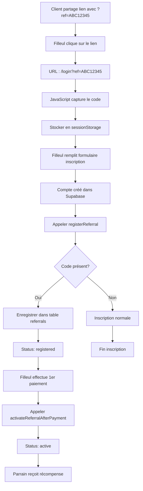

# 🔗 GUIDE D'INTÉGRATION DU PROCESSUS DE PARRAINAGE

## ⚠️ Important : Ce qui manquait

Le système de parrainage a été créé **SANS** l'intégration complète au processus d'inscription. Ce guide corrige ce manque.

---

## 📋 Fichiers créés pour combler les lacunes

| Fichier | Description |
|---------|-------------|
| **js/referral-signup.js** | Gestion complète du flux signup avec parrainage |
| **sql/parrainage_system_complements.sql** | Fonctions SQL additionnelles |
| **GUIDE_INTEGRATION_SIGNUP_PARRAINAGE.md** | Ce guide |

---

## 🎯 Flux Complet du Parrainage



---

## ⚡ ÉTAPE 1 : Charger le script

Dans **pages/login.html** (ou votre page d'inscription), ajouter :

```html
<!-- Avant </body> -->
<script src="../js/shared-config.js"></script>
<script src="../js/referral-signup.js?v=1.0"></script>
```

**📍 Position** : Après le chargement de Supabase, avant vos scripts métier.

---

## ⚡ ÉTAPE 2 : Capturer le code au chargement

Le script **referral-signup.js** le fait automatiquement, mais vous pouvez aussi l'appeler manuellement :

```javascript
// Au chargement de la page
document.addEventListener('DOMContentLoaded', () => {
    captureReferralCode(); // Capture automatique du ?ref=XXX
});
```

**Ce qui se passe** :
1. Lit le paramètre `ref` dans l'URL
2. Le stocke dans `sessionStorage.setItem('referral_code', code)`
3. Affiche un bandeau de bienvenue (optionnel)

---

## ⚡ ÉTAPE 3 : Intégrer dans le processus d'inscription

### Option A : Vous avez une page signup.html

Dans votre fonction de création de compte, **après** la création du compte Supabase :

```javascript
// Votre code d'inscription existant
const { data: authData, error: authError } = await supabase.auth.signUp({
    email: userEmail,
    password: userPassword,
    options: {
        data: {
            nom: userName,
            prenom: userPrenom
            // ... autres infos
        }
    }
});

if (authError) {
    console.error('❌ Erreur inscription:', authError);
    showAlert('Erreur lors de l\'inscription', 'error');
    return;
}

// ✅ NOUVEAU : Enregistrer le parrainage
const referralResult = await registerReferral(
    authData.user.email,
    authData.user.id
);

if (referralResult.referral) {
    console.log('🎉 Parrainage enregistré avec succès !');
    // Optionnel : Afficher un message
    showAlert('Votre parrainage a été enregistré !', 'success');
}
```

### Option B : Inscription via API externe

Si vous gérez l'inscription via API (Stripe, autre), appeler après confirmation :

```javascript
// Après réception de la confirmation d'inscription
async function handleSignupSuccess(userId, userEmail) {
    // Enregistrer le parrainage
    await registerReferral(userEmail, userId);
}
```

---

## ⚡ ÉTAPE 4 : Activer après le premier paiement

### Cas 1 : Paiement Stripe

Dans votre webhook Stripe (ou callback après paiement réussi) :

```javascript
// Webhook Stripe - Événement checkout.session.completed
stripe.webhooks.constructEvent(req.body, sig, webhookSecret);

if (event.type === 'checkout.session.completed') {
    const session = event.data.object;
    const userId = session.metadata.user_id; // Votre ID utilisateur
    
    // ✅ NOUVEAU : Activer le parrainage
    await activateReferralAfterPayment(userId);
}
```

### Cas 2 : Paiement direct Supabase

Si vous gérez les paiements directement dans votre app :

```javascript
async function processFirstPayment(userId, amount) {
    try {
        // Votre logique de paiement
        const paymentResult = await processPayment(userId, amount);
        
        if (paymentResult.success) {
            // ✅ NOUVEAU : Activer le parrainage
            await activateReferralAfterPayment(userId);
            
            console.log('✅ Paiement traité + Parrainage activé');
        }
    } catch (error) {
        console.error('❌ Erreur paiement:', error);
    }
}
```

### Cas 3 : Abonnement récurrent

Pour les abonnements récurrents, activer dès le premier paiement :

```javascript
// Lors de la création de l'abonnement
async function createSubscription(userId, planId) {
    const subscription = await stripe.subscriptions.create({
        customer: customerId,
        items: [{ price: planId }],
        metadata: { user_id: userId }
    });
    
    if (subscription.status === 'active') {
        // ✅ NOUVEAU : Activer le parrainage
        await activateReferralAfterPayment(userId);
    }
}
```

---

## ⚡ ÉTAPE 5 : Gérer l'arrêt de paiement

Quand un utilisateur arrête de payer (désabonnement, échec paiement) :

```javascript
async function handleSubscriptionCancelled(userId) {
    // Désactiver le parrainage
    const { error } = await supabase.rpc('deactivate_referral', {
        p_referred_user_id: userId
    });
    
    if (!error) {
        console.log('⚠️ Parrainage désactivé pour:', userId);
    }
}
```

---

## ⚡ ÉTAPE 6 : Gérer la réactivation

Si l'utilisateur reprend son abonnement :

```javascript
async function handleSubscriptionReactivated(userId) {
    // Réactiver le parrainage
    const { error } = await supabase.rpc('reactivate_referral', {
        p_referred_user_id: userId
    });
    
    if (!error) {
        console.log('✅ Parrainage réactivé pour:', userId);
    }
}
```

---

## 📊 ÉTAPE 7 : Exécuter les SQL additionnels

Après avoir exécuté `parrainage_system.sql`, exécuter aussi :

```sql
-- Ouvrir Supabase SQL Editor
-- Copier/coller le contenu de sql/parrainage_system_complements.sql
-- Exécuter
```

**Ce script ajoute** :
- ✅ `deactivate_referral()` - Désactiver un parrainage
- ✅ `reactivate_referral()` - Réactiver un parrainage
- ✅ `get_referrer_stats()` - Statistiques d'un parrain
- ✅ `is_referral_code_valid()` - Vérifier validité d'un code
- ✅ `track_referral_invitation()` - Tracker les invitations
- ✅ Vue `v_active_referrals` - Vue simplifiée des parrainages actifs

---

## 🧪 ÉTAPE 8 : Tester le flux complet

### Test 1 : Inscription avec code de parrainage

1. **Créer un code de test** (via admin ou SQL) :
```sql
-- Créer un parrain de test
INSERT INTO user_settings (user_id, referral_enabled, subscription_type)
VALUES ('<USER_ID_PARRAIN>', true, 'standard');

-- Son code sera généré automatiquement au premier chargement de l'onglet
```

2. **Récupérer le lien de parrainage** :
   - Se connecter avec le compte parrain
   - Ouvrir l'onglet "Parrainage"
   - Copier le lien (ex: `https://liveownerunit.com/login?ref=ABC12345`)

3. **Tester l'inscription** :
   - Ouvrir le lien en navigation privée
   - Vérifier que le bandeau "Vous avez été parrainé" s'affiche
   - Créer un nouveau compte
   - Vérifier dans la console : `✅ Parrainage enregistré avec succès`

4. **Vérifier en BDD** :
```sql
SELECT * FROM referrals WHERE referral_code = 'ABC12345';
-- Devrait montrer le nouveau filleul avec status = 'registered'
```

### Test 2 : Activation après paiement

1. Simuler un premier paiement pour le filleul
2. Appeler `activateReferralAfterPayment(filleulUserId)`
3. Vérifier en BDD :
```sql
SELECT * FROM referrals WHERE referred_user_id = '<FILLEUL_USER_ID>';
-- status devrait être 'active', is_currently_paying = true
```

4. Vérifier côté parrain :
   - Se connecter avec le compte parrain
   - Onglet "Parrainage"
   - Devrait afficher : "1/20 filleuls actifs" et la récompense

### Test 3 : Calcul mensuel des récompenses

```sql
-- Exécuter manuellement
SELECT calculate_monthly_referral_rewards();

-- Vérifier le résultat
SELECT * FROM referral_rewards WHERE user_id = '<PARRAIN_USER_ID>';
```

---

## 🔄 ÉTAPE 9 : Automatiser le calcul mensuel

### Option A : Supabase Cron (recommandé)

Créer un Cron Job dans Supabase :

```sql
-- Dans l'interface Supabase > Database > Cron Jobs
SELECT cron.schedule(
    'calculate-referral-rewards',
    '0 2 1 * *', -- 1er du mois à 2h du matin
    $$SELECT calculate_monthly_referral_rewards();$$
);
```

### Option B : Edge Function

Créer une Edge Function qui s'exécute mensuellement :

```typescript
// supabase/functions/calculate-rewards/index.ts
import { createClient } from '@supabase/supabase-js'

Deno.serve(async (req) => {
  const supabase = createClient(
    Deno.env.get('SUPABASE_URL') ?? '',
    Deno.env.get('SUPABASE_SERVICE_ROLE_KEY') ?? ''
  )

  const { error } = await supabase.rpc('calculate_monthly_referral_rewards')
  
  if (error) throw error
  
  return new Response(JSON.stringify({ success: true }), {
    headers: { 'Content-Type': 'application/json' },
  })
})
```

Puis configurer un cron externe pour l'appeler.

---

## 📧 ÉTAPE 10 (Optionnel) : Notifications

### Email de bienvenue au filleul

Après `registerReferral()` :

```javascript
async function sendWelcomeEmailToReferee(email, referrerName) {
    // Utiliser votre système d'email (Resend, SendGrid, etc.)
    await sendEmail({
        to: email,
        subject: 'Bienvenue sur LiveOwnerUnit !',
        html: `
            <h1>Bienvenue ! 🎉</h1>
            <p>Vous avez été parrainé par <strong>${referrerName}</strong>.</p>
            <p>Vous bénéficiez d'avantages exclusifs !</p>
        `
    });
}
```

### Email au parrain quand filleul devient actif

Après `activateReferralAfterPayment()` :

```javascript
async function notifyReferrerOfActivation(referrerId) {
    // Récupérer les infos du parrain
    const { data: referrer } = await supabase
        .from('user_settings')
        .select('user_id')
        .eq('user_id', referrerId)
        .single();
    
    // Envoyer email
    await sendEmail({
        to: referrer.email,
        subject: 'Un de vos filleuls est actif ! 🎉',
        html: `
            <h1>Bonne nouvelle !</h1>
            <p>Un de vos filleuls vient d'activer son abonnement.</p>
            <p>Votre récompense a été mise à jour automatiquement.</p>
        `
    });
}
```

---

## ✅ Checklist finale

### Base de données
- [ ] `parrainage_system.sql` exécuté
- [ ] `parrainage_system_complements.sql` exécuté
- [ ] Tables vérifiées (4 tables)
- [ ] Fonctions vérifiées (8 fonctions)
- [ ] Cron job configuré pour calcul mensuel

### Frontend
- [ ] `referral-signup.js` chargé dans login.html
- [ ] Capture du code `?ref=XXX` fonctionne
- [ ] Bandeau de bienvenue s'affiche
- [ ] SessionStorage utilisé correctement

### Processus signup
- [ ] `registerReferral()` appelé après création compte
- [ ] Lien parrain → filleul enregistré en BDD
- [ ] Status initial = 'registered'
- [ ] Console log confirme l'enregistrement

### Processus paiement
- [ ] `activateReferralAfterPayment()` appelé après 1er paiement
- [ ] Status passe à 'active'
- [ ] `is_currently_paying` = true
- [ ] Récompenses calculées automatiquement

### Gestion lifecycle
- [ ] Désactivation si arrêt paiement OK
- [ ] Réactivation si reprise paiement OK
- [ ] Calcul mensuel automatique OK
- [ ] Stats temps réel dans onglet Parrainage OK

### Tests
- [ ] Test complet inscription avec code
- [ ] Test activation après paiement
- [ ] Test désactivation
- [ ] Test réactivation
- [ ] Test calcul mensuel manuel
- [ ] Vérification admin interface OK

---

## 🐛 Troubleshooting

### Problème : Code de parrainage non capturé

**Symptôme** : Le lien `?ref=XXX` ne fonctionne pas

**Solutions** :
1. Vérifier que `referral-signup.js` est bien chargé
2. Ouvrir la console : `sessionStorage.getItem('referral_code')`
3. Vérifier que l'URL contient bien `?ref=`

### Problème : Parrainage non enregistré à l'inscription

**Symptôme** : Compte créé mais pas de lien dans `referrals`

**Solutions** :
1. Vérifier que `registerReferral()` est appelé
2. Vérifier les logs console
3. Tester la fonction `process_referral_signup` directement :
```sql
SELECT process_referral_signup('ABC12345', 'test@example.com', '<user_id>');
```

### Problème : Parrainage non activé après paiement

**Symptôme** : Status reste 'registered' même après paiement

**Solutions** :
1. Vérifier que `activateReferralAfterPayment()` est appelé
2. Tester manuellement :
```sql
SELECT activate_referral('<referred_user_id>');
```
3. Vérifier que le `referred_user_id` est correct

### Problème : Récompenses pas calculées

**Symptôme** : Parrain ne voit pas sa réduction/points

**Solutions** :
1. Exécuter manuellement : `SELECT calculate_monthly_referral_rewards();`
2. Vérifier la table `referral_rewards`
3. Vérifier le trigger sur la table `referrals`

---

## 📞 Support

Si problème persistant :
1. Vérifier tous les logs console (F12)
2. Vérifier les données en BDD avec les requêtes de debug
3. Consulter `DOCUMENTATION_SYSTEME_PARRAINAGE.md`
4. Vérifier que RLS est bien configuré

---

## 🎉 Félicitations !

Une fois tous les éléments intégrés, votre système de parrainage est **100% fonctionnel** :

✅ Capture automatique des codes de parrainage  
✅ Enregistrement des filleuls à l'inscription  
✅ Activation automatique après premier paiement  
✅ Calcul mensuel des récompenses  
✅ Gestion complète du lifecycle  
✅ Interface admin pour contrôle total  

**Le système est maintenant production-ready ! 🚀**
