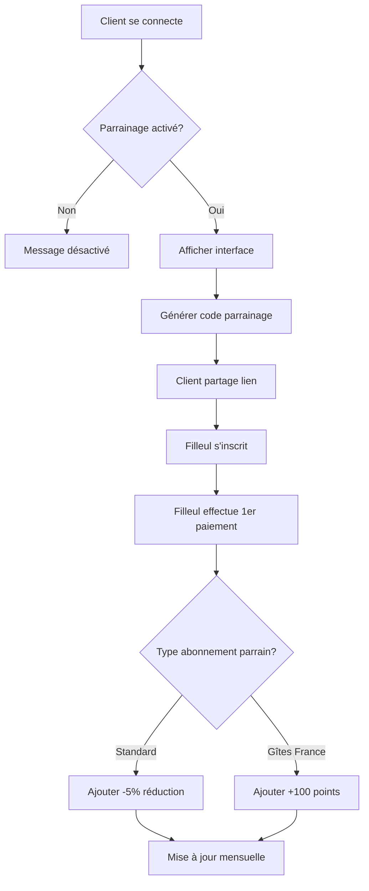

# 🎯 SYSTÈME DE PARRAINAGE LIVEOWNERUNIT

## 📋 Table des Matières

1. [Vue d'ensemble](#vue-densemble)
2. [Architecture](#architecture)
3. [Cas d'usage : Gîtes de France](#cas-dusage--gîtes-de-france)
4. [Installation & Configuration](#installation--configuration)
5. [Interface Admin](#interface-admin)
6. [Interface Client](#interface-client)
7. [Fonctionnalités](#fonctionnalités)
8. [Tables de base de données](#tables-de-base-de-données)
9. [API & Fonctions](#api--fonctions)

---

## Vue d'ensemble

Le système de parrainage LiveOwnerUnit permet aux clients de recommander la plateforme et de recevoir des récompenses. Il supporte **deux modèles de récompenses** selon le type d'abonnement :

### 🏆 **Modèle Standard**
- **-5% de réduction par filleul actif**
- **Maximum : -100%** (abonnement gratuit à vie)
- **20 filleuls maximum**
- Appliqué automatiquement sur l'abonnement mensuel

### 💎 **Modèle Gîtes de France** (abonnement payé par l'organisme)
- **100 points par filleul actif**
- **Maximum : 2000 points** (20 filleuls)
- **Convertibles en** :
  - 🎨 **Crédits IA** : 100 pts = 200 générations
  - 📄 **Templates Premium** : 300 pts = 1 template
  - 🛒 **Bon Marketplace** : 500 pts = bon d'achat 50€
  - 🎓 **Formation Exclusive** : 800 pts = accès formation

---

## Architecture

### 📁 Fichiers créés

```
/workspaces/Gestion_gite-calvignac/
│
├── tabs/
│   └── tab-parrainage.html          # Interface client (onglet)
│
├── js/
│   └── parrainage.js                # Logique métier client
│
├── sql/
│   └── parrainage_system.sql        # Tables & fonctions BDD
│
└── js/
    └── admin-clients.js (modifié)   # Gestion admin du parrainage
```

### 🔄 Flux du système



---

## Cas d'usage : Gîtes de France

### 🎯 **Problématique identifiée**

Certains clients de LiveOwnerUnit sont membres de **Gîtes de France**, qui :
- Peut **payer directement l'abonnement** pour ses membres
- Négocier des tarifs de groupe
- Offrir l'abonnement comme avantage adhésion

💡 **Conséquence** : Une réduction tarifaire n'a aucun sens pour ces utilisateurs, car ils ne paient pas directement.

### ✅ **Solution : Système de Points**

Au lieu de réductions tarifaires, ces utilisateurs accumulent des **points convertibles** :

| Action | Points gagnés |
|--------|---------------|
| 1 filleul actif | 100 points |
| 5 filleuls actifs | 500 points |
| 10 filleuls actifs | 1000 points |
| 20 filleuls actifs | 2000 points (MAX) |

### 🎁 **Catalogue de récompenses**

| Récompense | Coût | Valeur réelle |
|------------|------|---------------|
| 200 générations IA | 100 pts | ~10€ |
| 1 Template Premium | 300 pts | ~30€ |
| Bon Marketplace 50€ | 500 pts | 50€ |
| Formation Exclusive | 800 pts | ~150€ |
| Badge Ambassadeur | Gratuit | Prestige |

### 🔧 **Configuration Admin**

L'admin peut :
1. **Activer/Désactiver** le parrainage pour un client
2. **Choisir le type** : Standard ou Gîtes de France
3. **Suivre les statistiques** de chaque parrain
4. **Valider les conversions** de points (si nécessaire)

---

## Installation & Configuration

### 1️⃣ **Exécuter le script SQL**

```bash
# Se connecter à Supabase
psql -h <SUPABASE_HOST> -U postgres -d postgres

# Exécuter le script
\i sql/parrainage_system.sql
```

### 2️⃣ **Ajouter QRCode.js au HTML**

Dans `index.html` (ou `<head>` de l'onglet) :

```html
<!-- QR Code Generator -->
<script src="https://cdnjs.cloudflare.com/ajax/libs/qrcodejs/1.0.0/qrcode.min.js"></script>
```

### 3️⃣ **Intégrer l'onglet Parrainage (Optionnel)**

**⚠️ ATTENTION : Ne pas modifier index.html sans accord explicite !**

Pour rendre l'onglet disponible, ajouter dans la navigation :

```html
<button class="nav-tab" data-tab="parrainage" data-theme="purple">
    <i data-lucide="users" class="tab-icon"></i>
    <span class="tab-label">Parrainage</span>
</button>
```

Et le conteneur :

```html
<div id="tab-parrainage" class="tab-content"></div>
```

**Configuration du chargement dynamique** (dans le JavaScript de gestion des onglets) :

```javascript
const tabContents = {
    // ... autres onglets
    'tab-parrainage': 'tabs/tab-parrainage.html'
};
```

### 4️⃣ **Charger le JavaScript**

Dans `index.html`, avant `</body>` :

```html
<script src="js/parrainage.js?v=1.0"></script>
```

---

## Interface Admin

### 🎛️ **Accès : `/pages/admin-clients.html`**

Dans la fiche client, onglet **"Parrainage"** :

#### **Section Configuration**

- ✅ **Activation** : Activer/désactiver le programme pour ce client
- 🔄 **Type d'abonnement** :
  - Standard (réductions %)
  - Gîtes de France (points)

#### **Section Statistiques**

- 📊 **Parrainages total** : Nombre de filleuls parrainés
- 🟢 **Filleuls actifs** : Nombre payant actuellement
- ⏳ **En attente** : Inscrits mais pas encore payants
- 💰 **Récompense actuelle** : Réduction % ou Points

#### **Section Filleuls**

Liste détaillée avec :
- Email du filleul
- Statut (Actif / Inactif / En attente)
- Date d'inscription
- Dernier paiement
- Récompense générée

---

## Interface Client

### 🎨 **Accès : Onglet "Parrainage" dans l'interface utilisateur**

#### **Carte de Statut Principal**

Affiche :
- 🎁 **Récompense actuelle** (% ou points)
- 📈 **Barre de progression** (X/20 filleuls)
- 🎯 **Prochain objectif**

#### **Lien de Parrainage**

- 🔗 Lien unique : `https://liveownerunit.com/login?ref=XXXXXXXX`
- 📋 Bouton copier
- 📱 Partage sur réseaux sociaux (Email, WhatsApp, LinkedIn)
- 🔲 **QR Code téléchargeable**

#### **Statistiques**

- 📨 Invitations envoyées
- 📝 Inscriptions totales
- ✅ Filleuls actifs
- 💵 Économies totales / Points cumulés

#### **Convertisseur de Points** (uniquement Gîtes de France)

Interface pour convertir les points en récompenses :
- Crédits IA
- Templates
- Bons marketplace
- Formations

#### **Liste des Filleuls**

Vue détaillée avec statut en temps réel.

#### **Conseils de Partage**

- Groupes Facebook propriétaires
- Forums spécialisés
- Réunions Gîtes de France
- Événements locaux
- QR Code imprimé

---

## Fonctionnalités

### ✨ **Fonctionnalités Client**

| Fonctionnalité | Description |
|----------------|-------------|
| 🔗 Génération lien | Code unique de 8 caractères |
| 📋 Copie rapide | Copier le lien en 1 clic |
| 📱 Partage social | Email, WhatsApp, LinkedIn |
| 🔲 QR Code | Génération et téléchargement automatique |
| 📊 Tableau de bord | Stats en temps réel |
| 💎 Conversion points | Interface dédiée (GdF) |
| 🎁 Suivi filleuls | Liste complète avec statuts |

### 🛠️ **Fonctionnalités Admin**

| Fonctionnalité | Description |
|----------------|-------------|
| ⚙️ Activation | Activer/désactiver par client |
| 🔄 Type d'abonnement | Standard vs Gîtes de France |
| 📈 Statistiques détaillées | Vue complète par client |
| 👥 Gestion filleuls | Voir et gérer les parrainages |
| ✅ Validation conversions | Approuver les demandes de conversion |
| 📊 Dashboard global | Vue d'ensemble du programme |

---

## Tables de base de données

### 📊 **referrals**

Table principale des parrainages.

```sql
CREATE TABLE referrals (
    id UUID PRIMARY KEY DEFAULT gen_random_uuid(),
    referrer_id UUID NOT NULL,           -- Parrain
    referral_code VARCHAR(8) UNIQUE,     -- Code unique (ex: ABC12345)
    referred_email VARCHAR(255),          -- Email du filleul
    referred_user_id UUID,                -- ID utilisateur filleul (après inscription)
    status VARCHAR(20),                   -- 'pending', 'registered', 'active', 'inactive'
    registered_at TIMESTAMPTZ,            -- Date d'inscription
    first_payment_at TIMESTAMPTZ,         -- Premier paiement
    last_payment_at TIMESTAMPTZ,          -- Dernier paiement
    is_currently_paying BOOLEAN,          -- Paie actuellement ?
    created_at TIMESTAMPTZ DEFAULT NOW()
);
```

**Statuts possibles** :
- `pending` : Lien partagé, pas encore inscrit
- `registered` : Inscrit, pas encore payé
- `active` : Inscrit ET paye actuellement
- `inactive` : Inscrit mais ne paie plus

### 📊 **referral_invitations**

Tracking des invitations envoyées.

```sql
CREATE TABLE referral_invitations (
    id UUID PRIMARY KEY DEFAULT gen_random_uuid(),
    referrer_id UUID NOT NULL,
    channel VARCHAR(20),                  -- 'email', 'whatsapp', 'linkedin', 'copy', 'qr'
    recipient_email VARCHAR(255),
    sent_at TIMESTAMPTZ DEFAULT NOW(),
    opened_at TIMESTAMPTZ,
    clicked_at TIMESTAMPTZ
);
```

### 📊 **referral_rewards**

Récompenses calculées mensuellement.

```sql
CREATE TABLE referral_rewards (
    id UUID PRIMARY KEY DEFAULT gen_random_uuid(),
    user_id UUID NOT NULL,
    month DATE NOT NULL,
    active_referrals_count INT,           -- Nombre de filleuls actifs
    discount_pct DECIMAL(5,2),            -- Réduction en % (standard)
    points_earned INT,                    -- Points gagnés (Gîtes de France)
    total_saved DECIMAL(10,2),            -- Économies totales
    calculated_at TIMESTAMPTZ DEFAULT NOW(),
    UNIQUE(user_id, month)
);
```

### 📊 **referral_point_conversions**

Conversions de points (uniquement Gîtes de France).

```sql
CREATE TABLE referral_point_conversions (
    id UUID PRIMARY KEY DEFAULT gen_random_uuid(),
    user_id UUID NOT NULL,
    reward_type VARCHAR(50),              -- 'ai-credits', 'template', 'marketplace', 'formation'
    points_cost INT NOT NULL,
    reward_details JSONB,
    converted_at TIMESTAMPTZ DEFAULT NOW(),
    status VARCHAR(20) DEFAULT 'pending'  -- 'pending', 'delivered', 'cancelled'
);
```

### 📊 **user_settings** (colonnes ajoutées)

Configuration par utilisateur.

```sql
ALTER TABLE user_settings ADD COLUMN referral_enabled BOOLEAN DEFAULT false;
ALTER TABLE user_settings ADD COLUMN subscription_type VARCHAR(20) DEFAULT 'standard';
```

---

## API & Fonctions

### 🔧 **Fonctions PostgreSQL**

#### `calculate_monthly_referral_rewards()`

Calcule automatiquement les récompenses mensuelles pour tous les utilisateurs.

**Utilisation** :
```sql
SELECT calculate_monthly_referral_rewards();
```

**Planification** : À exécuter via un cron job le 1er de chaque mois.

#### `process_referral_signup(code, email, user_id)`

Traite une nouvelle inscription via lien de parrainage.

**Exemple** :
```sql
SELECT process_referral_signup('ABC12345', 'nouveau@example.com', '<user_id>');
```

#### `activate_referral(user_id)`

Active un parrainage après le premier paiement.

**Exemple** :
```sql
SELECT activate_referral('<referred_user_id>');
```

### 📡 **JavaScript API côté Client**

#### `initReferralSystem()`

Initialise le système de parrainage.

```javascript
await initReferralSystem();
```

#### `refreshReferralData()`

Actualise les données en temps réel.

```javascript
await refreshReferralData();
```

#### `copyReferralLink()`

Copie le lien de parrainage dans le presse-papier.

```javascript
copyReferralLink();
```

#### `shareViaEmail()` / `shareViaWhatsApp()` / `shareViaLinkedIn()`

Partage le lien via différents canaux.

```javascript
shareViaEmail();
shareViaWhatsApp();
shareViaLinkedIn();
```

#### `convertPoints(type, cost)`

Convertit des points en récompense (Gîtes de France uniquement).

```javascript
await convertPoints('ai-credits', 100);
```

---

## 📈 Métriques & Suivi

### KPIs Importants

| Métrique | Description | Objectif |
|----------|-------------|----------|
| **Taux d'activation** | % utilisateurs activant le parrainage | > 30% |
| **Taux de conversion** | % invitations → inscriptions | > 10% |
| **Taux d'activité** | % filleuls payants | > 50% |
| **Viralité** | Nombre moyen de filleuls par parrain | > 2 |
| **LTV parrain** | Valeur vie client des parrains | +50% |

### Dashboard Admin (à implémenter)

- 📊 Graphique évolution parrainages
- 🏆 Top parrains
- 💰 ROI du programme
- 📈 Taux de conversion par canal
- 🎯 Objectifs mensuels

---

## 🚀 Roadmap

### Phase 1 : MVP ✅ (Actuel)
- [x] Système de base
- [x] 2 modèles de récompenses
- [x] Interface client
- [x] Interface admin
- [x] Tracking invitations

### Phase 2 : Optimisations 🔄 (À venir)
- [ ] Dashboard admin global
- [ ] Emails automatiques
- [ ] Notifications push
- [ ] Gamification
- [ ] Badges ambassadeur

### Phase 3 : Advanced 🔮 (Futur)
- [ ] Programme VIP (>10 filleuls)
- [ ] Concours mensuels
- [ ] Affiliate marketing
- [ ] API publique

---

## 📞 Support

Pour toute question ou problème :
- 📧 Email : support@liveownerunit.com
- 💬 Chat : Interface support admin
- 📚 Documentation : `/docs/parrainage-system`

---

## 🔐 Sécurité & Conformité

### ✅ Mesures de sécurité

- 🔒 **RLS Supabase** : Isolation des données par utilisateur
- 🔑 **Codes uniques** : 8 caractères, vérification unicité
- 🚫 **Anti-abus** : Max 20 filleuls par parrain
- 📊 **Audit trail** : Toutes actions tracées
- 🔐 **RGPD** : Consentement explicite requis

### 📋 Conformité légale

- ✅ **Conditions d'utilisation** : Clause parrainage
- ✅ **Mentions légales** : Programme détaillé
- ✅ **Fiscalité** : Récompenses déclarables (si > seuil)
- ✅ **RGPD** : Droit de retrait

---

## 💡 Conseils d'utilisation

### Pour les Clients

1. **Activez votre lien** dès que possible
2. **Partagez régulièrement** sur différents canaux
3. **Montrez vos résultats concrets** avec LiveOwnerUnit
4. **Utilisez le QR Code** lors d'événements physiques
5. **Suivez vos stats** pour optimiser votre partage

### Pour les Admins

1. **Activez progressivement** : Commencer par clients engagés
2. **Communiquez clairement** : Expliquer les 2 systèmes
3. **Suivez les KPIs** : Ajuster selon les performances
4. **Récompensez rapidement** : Valider conversions sous 48h
5. **Animez le programme** : Concours, highlights mensuels

---

## 🎓 Cas d'usage réels

### Exemple 1 : Client Standard "Pierre"

- 🏠 Propriétaire de 3 gîtes
- 📅 Inscrit depuis 6 mois
- 👥 **5 filleuls actifs** parrainés
- 💰 **Réduction : -25%** (5 × -5%)
- 💵 **Économies : 7,50€/mois** (30€ × 25%)
- 📈 **ROI : 90€/an** d'économies

### Exemple 2 : Client Gîtes de France "Marie"

- 🏠 Membre Gîtes de France depuis 10 ans
- 🤝 Abonnement payé par l'organisme
- 👥 **12 filleuls actifs** parrainés
- 💎 **Points cumulés : 1200 points**
- 🎁 **Conversions effectuées** :
  - 2× Templates Premium (600 pts)
  - 6× Packs de crédits IA (600 pts)
- 🏆 **Badge Ambassadeur** débloqué
- 📊 **Influence** : Top 3 parrains nationaux

---

**Version** : 1.0  
**Date** : 5 février 2026  
**Auteur** : LiveOwnerUnit Team
