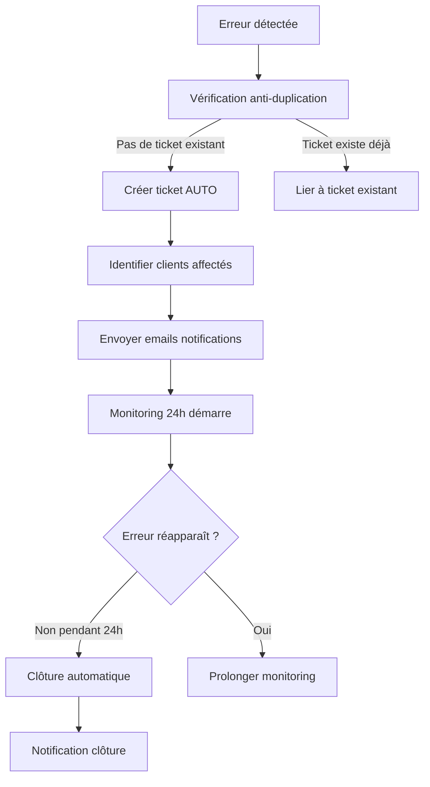

# 📊 Guide Complet - Monitoring & Gestion Tickets

**Système unifié de monitoring d'erreurs et gestion automatique des tickets support**

---

## 📋 Table des matières

1. [Vue d'ensemble](#vue-densemble)
2. [Architecture](#architecture)
3. [Installation & Configuration](#installation--configuration)
4. [Utilisation](#utilisation)
5. [Workflow des tickets](#workflow-des-tickets)
6. [Administration](#administration)
7. [Référence API](#référence-api)
8. [Dépannage](#dépannage)

---

## 🎯 Vue d'ensemble

### Fonctionnalités principales

✅ **Capture automatique des erreurs**
- Erreurs JavaScript (syntax, runtime, promises)
- Erreurs console (error, warn)
- Erreurs HTTP (fetch, API)
- Détection en temps réel

✅ **Création automatique de tickets**
- **DÈS la première erreur** (seuil = 1)
- **Anti-duplication** par signature d'erreur
- **Multi-clients** : tous les clients concernés sont notifiés
- Monitoring 24h automatique
- Clôture automatique si résolu

✅ **Notifications**
- Email automatique aux clients affectés
- Notifications admin
- Templates HTML personnalisables

✅ **Interface de suivi**
- Dashboard monitoring avec erreurs actives
- Badge tickets par erreur
- Timeline complète de chaque ticket
- Actions rapides (statut, commentaires)

---

## 🏗️ Architecture

### Composants

```
📦 Système Auto-Ticket
├── 📊 Monitoring (admin-monitoring.html)
│   ├── Capture erreurs en temps réel
│   ├── Affichage groupé par type
│   └── Badge tickets associés
│
├── 🎫 Gestion Tickets (admin-support.html)
│   ├── Liste tous les tickets
│   ├── Filtres (statut, priorité, client)
│   └── Statistiques
│
├── 🔄 Workflow (admin-ticket-workflow.html)
│   ├── Détails complets du ticket
│   ├── Timeline des actions
│   ├── Section erreur + corrections
│   └── Actions rapides
│
└── 🤖 Système automatique (auto-ticket-system.js)
    ├── Détection erreurs
    ├── Création tickets
    ├── Monitoring 24h
    └── Clôture automatique
```

### Tables de base de données

```sql
-- Tickets (existante, colonnes ajoutées)
cm_support_tickets
├── id (UUID)
├── client_id (UUID)
├── client_email (TEXT)
├── sujet (TEXT)
├── description (TEXT)
├── priorite (TEXT: haute/moyenne/basse)
├── statut (TEXT: ouvert/en_cours/en_attente_client/resolu/ferme)
├── categorie (TEXT)
├── created_at (TIMESTAMPTZ)
├── updated_at (TIMESTAMPTZ)
├── error_signature (TEXT) ← NOUVEAU
├── error_id (UUID) ← NOUVEAU
├── source (TEXT) ← NOUVEAU (auto_detection/manual)
├── resolution (TEXT) ← NOUVEAU
├── closed_at (TIMESTAMPTZ) ← NOUVEAU
└── metadata (JSONB) ← NOUVEAU

-- Historique des tickets (nouvelle)
cm_support_ticket_history
├── id (UUID)
├── ticket_id (UUID)
├── action (TEXT)
├── description (TEXT)
├── created_by (TEXT)
└── created_at (TIMESTAMPTZ)

-- Corrections d'erreurs (nouvelle)
cm_error_corrections
├── id (UUID)
├── error_id (UUID)
├── file_path (TEXT)
├── old_code (TEXT)
├── new_code (TEXT)
├── description (TEXT)
├── applied_by (TEXT)
├── applied_at (TIMESTAMPTZ)
├── test_status (TEXT)
└── test_results (JSONB)

-- Erreurs système (existante)
cm_error_logs
├── id (UUID)
├── error_type (TEXT)
├── message (TEXT)
├── source (TEXT)
├── stack_trace (TEXT)
├── resolved (BOOLEAN)
├── timestamp (TIMESTAMPTZ)
└── metadata (JSONB)
```

---

## 🚀 Installation & Configuration

### 1️⃣ Exécuter le SQL

**Fichier :** `sql/create_auto_ticket_tables_v2.sql`

```bash
# 1. Copier le contenu du fichier
# 2. Aller sur Supabase Dashboard > SQL Editor
# 3. Nouvelle requête
# 4. Coller et exécuter
```

**Résultat attendu :**
```
✅ 2 tables créées (cm_support_ticket_history, cm_error_corrections)
✅ 6 colonnes ajoutées à cm_support_tickets
```

### 2️⃣ Vérifier l'installation

**Console (pages/admin-monitoring.html) :**
```javascript
await diagAutoTicket.checkStatus()
```

**Résultat attendu :**
```
✅ Supabase disponible
✅ Instance active
✅ cm_support_tickets existe
✅ cm_support_ticket_history existe
✅ cm_error_corrections existe
📊 X erreur(s) non résolue(s)
🤖 X ticket(s) auto-créé(s)
```

### 3️⃣ Configuration email (optionnel)

**Créer `.env` à la racine :**
```env
SMTP_HOST=smtp.gmail.com
SMTP_PORT=587
SMTP_USER=votre@email.com
SMTP_PASS=votre-mot-de-passe-app
SMTP_FROM="Support Gîtes <votre@email.com>"
```

**Pour Gmail :**
1. Activer authentification 2FA
2. https://myaccount.google.com/apppasswords
3. Créer mot de passe d'application
4. Copier dans `SMTP_PASS`

### 4️⃣ Activer Realtime (optionnel)

**Supabase Dashboard :**
1. Settings > API > Realtime
2. Enable
3. Tables with Realtime enabled → Ajouter `cm_error_logs`
4. Save

**Note :** Sans Realtime, les tickets sont toujours créés mais via `forceCreateTicket()` manuel.

---

## 🎮 Utilisation

### Monitoring des erreurs

**Interface :** `pages/admin-monitoring.html`

**Fonctionnalités :**
- ✅ Visualisation des erreurs actives
- ✅ Groupement par type/source
- ✅ Nombre d'occurrences
- ✅ Badge tickets associés
- ✅ Actions : Détails, Créer ticket, Résoudre

**Créer un ticket depuis une erreur :**
```javascript
// 1. Cliquer sur "Créer Ticket" à côté de l'erreur
// OU en console :
await diagAutoTicket.forceCreateTicket('error-uuid-ici')
```

### Gestion des tickets

**Interface :** `pages/admin-support.html`

**Actions disponibles :**
- Voir tous les tickets
- Filtrer par statut, priorité, client
- Ouvrir le workflow complet
- Statistiques en temps réel

### Workflow d'un ticket

**Interface :** `pages/admin-ticket-workflow.html?ticket=TICKET_ID`

**Sections :**

#### 📊 Résumé
- Statut actuel
- Priorité
- Client concerné
- Source (auto/manuel)
- Dates création/clôture

#### ⚠️ Erreur associée
- Fichier et ligne
- Message complet
- Stack trace
- Corrections appliquées

#### 📅 Timeline
- Historique de toutes les actions
- Icônes et couleurs par type d'action
- Horodatage précis
- Auteur de chaque action

#### ⚡ Actions rapides
- Changer statut
- Ouvrir dans Support
- Voir erreur complète
- Notifier le client
- Marquer résolu
- Fermer le ticket
- Ajouter commentaire

---

## 🔄 Workflow des tickets

### Cycle de vie d'un ticket auto



### Statuts des tickets

| Statut | Description | Actions possibles |
|--------|-------------|-------------------|
| **ouvert** | Nouveau ticket non traité | → En cours, Assigner |
| **en_cours** | Ticket en traitement | → En attente client, Résolu |
| **en_attente_client** | Attente action client | → En cours, Résolu |
| **resolu** | Problème résolu | → Fermer, Réouvrir |
| **ferme** | Ticket clôturé | → Réouvrir si besoin |

### Anti-duplication

**Signature d'erreur :**
```javascript
signature = `${source}|${message}|${lineNumber}`
```

**Exemple :**
```
"auto-ticket-system.js|Cannot read properties of undefined|579"
```

- ✅ Même signature = 1 seul ticket
- ✅ Tous les clients affectés liés au même ticket
- ✅ Chaque client reçoit sa notification

---

## 👨‍💼 Administration

### Commandes diagnostic

**Console (admin-monitoring.html) :**

```javascript
// Vérifier l'état du système
await diagAutoTicket.checkStatus()

// Test complet automatisé
await diagAutoTicket.testSystem()

// Créer ticket manuellement pour une erreur
await diagAutoTicket.forceCreateTicket('error-uuid')

// Réinitialiser le système
await diagAutoTicket.reinit()

// Guide de dépannage
diagAutoTicket.troubleshoot()

// Vérifier le seuil de création
window.autoTicketSystemInstance.config.autoCreateTicketThreshold
// → Doit afficher: 1

// Modifier le seuil (pour test uniquement)
window.autoTicketSystemInstance.config.autoCreateTicketThreshold = 1;
```

### Actions sur les tickets

**Depuis le monitoring :**
```javascript
// Afficher tickets d'une erreur
showErrorTickets(index)

// Créer ticket pour une erreur
createTicketForError(index)

// Ouvrir workflow
openTicket(ticketId)

// Changer statut
updateTicketStatus(ticketId, 'en_cours')
```

**Depuis le workflow :**
```javascript
// Charger un ticket
const workflow = new TicketWorkflow(ticketId);
await workflow.load();

// Changer statut
await workflow.changeStatus('resolu', 'Note optionnelle');

// Assigner
await workflow.assign('admin@site.com', 'Note');

// Ajouter commentaire
await workflow.addComment('Commentaire texte', 'admin');

// Ajouter entrée historique
await workflow.addHistory('action', 'Description', 'auteur');
```

### Enregistrer une correction

**Après avoir corrigé un bug :**
```javascript
await window.logCorrection('error-uuid', {
    filePath: 'js/fichier.js',
    oldCode: 'ancien code...',
    newCode: 'nouveau code...',
    description: 'Description de la correction'
});
```

**Batch de corrections :**
```javascript
const corrections = [
    {
        errorId: 'uuid-1',
        filePath: 'js/file1.js',
        oldCode: '...',
        newCode: '...',
        description: '...'
    },
    // ...
];

await window.logAllCorrections(corrections);
```

---

## 📚 Référence API

### AutoTicketSystem

```javascript
class AutoTicketSystem {
    // Configuration
    config = {
        autoCreateTicketThreshold: 1,    // Seuil de création
        monitoringDuration: 86400000,    // 24h en ms
        emailTemplate: 'error-detected',
        ticketPriority: 'high'
    }
    
    // Méthodes principales
    async init()                              // Initialiser le système
    async handleNewError(error)               // Gérer nouvelle erreur
    async shouldCreateTicket(error)           // Vérifier si créer ticket
    async createAutoTicket(error)             // Créer ticket auto
    async startTicketMonitoring(ticketId)     // Démarrer monitoring
    async autoCloseTicket(ticketId)           // Clôturer auto
    async getAffectedClients(error)           // Récupérer clients affectés
    async notifyAllAffectedClients(...)       // Notifier tous clients
    generateErrorSignature(error)             // Générer signature
}
```

### TicketWorkflow

```javascript
class TicketWorkflow {
    // Chargement
    async load()                              // Charger toutes données
    async loadTicket()                        // Charger détails ticket
    async loadHistory()                       // Charger historique
    async loadError()                         // Charger erreur liée
    async loadCorrections()                   // Charger corrections
    
    // Actions
    async changeStatus(status, note)          // Changer statut
    async assign(assignedTo, note)            // Assigner ticket
    async addComment(comment, author)         // Ajouter commentaire
    async addHistory(action, desc, author)    // Ajouter historique
    
    // Rendu
    renderSummary()                           // HTML résumé
    renderTimeline()                          // HTML timeline
    renderErrorSection()                      // HTML erreur
}
```

### Diagnostic

```javascript
class AutoTicketDiagnostic {
    async checkStatus()                       // Vérifier état système
    async testSystem()                        // Test automatisé complet
    async forceCreateTicket(errorId)          // Créer ticket manuel
    async reinit()                            // Réinitialiser
    troubleshoot()                            // Guide dépannage
}
```

---

## 🔧 Dépannage

### Problème : Tickets non créés automatiquement

**Causes possibles :**
1. ❌ Realtime non activé → ✅ Utiliser `forceCreateTicket()`
2. ❌ Seuil non atteint → ✅ Vérifier `config.autoCreateTicketThreshold`
3. ❌ Ticket déjà existant → ✅ Vérifier signature erreur

**Solution :**
```javascript
// Vérifier configuration
window.autoTicketSystemInstance.config.autoCreateTicketThreshold
// Si > 1, réduire à 1

// Créer manuellement
await diagAutoTicket.forceCreateTicket('error-uuid')
```

### Problème : Tables 404

**Cause :** SQL non exécuté

**Solution :**
1. Exécuter `sql/create_auto_ticket_tables_v2.sql` dans Supabase
2. Vérifier avec `await diagAutoTicket.checkStatus()`

### Problème : Emails non envoyés

**Causes possibles :**
1. ❌ `.env` non configuré
2. ❌ Credentials SMTP incorrects
3. ❌ Port bloqué

**Solution :**
```bash
# Tester SMTP
curl -X POST http://localhost:3000/api/send-email \
  -H "Content-Type: application/json" \
  -d '{...}'
```

### Problème : Auto-close ne fonctionne pas

**Cause :** Monitoring non démarré

**Solution :**
```javascript
// Vérifier tickets actifs
window.autoTicketSystemInstance.activeTickets
// → Doit contenir tickets en monitoring

// Reprendre monitoring
await window.autoTicketSystemInstance.resumeActiveTickets()
```

### Erreurs console persistantes

**Erreurs ignorées (normales) :**
- ✅ `webpage_content_reporter` (extension Chrome)
- ✅ `validation_status` column not found (attendu)
- ✅ `monitoring_start` column not found (attendu)

**Erreurs à traiter :**
- ❌ Erreurs de syntaxe
- ❌ Cannot read properties of undefined
- ❌ HTTP 500/404 sur APIs

---

## 📊 Métriques & KPI

### Dashboard Admin

**Statistiques disponibles :**
- Total tickets créés (auto vs manuel)
- Taux de résolution automatique
- Temps moyen de résolution
- Erreurs les plus fréquentes
- Clients les plus affectés

**Commande :**
```javascript
// Dans admin-monitoring.html
await loadMonitoringData()
```

---

## 🎯 Checklist Post-Installation

- [ ] SQL `create_auto_ticket_tables_v2.sql` exécuté
- [ ] Tables créées (checkStatus = ✅)
- [ ] Auto-Ticket System initialisé
- [ ] Seuil configuré à 1
- [ ] Test manuel réussi (`forceCreateTicket`)
- [ ] Badge tickets visible dans monitoring
- [ ] Workflow accessible
- [ ] (Optionnel) Emails configurés
- [ ] (Optionnel) Realtime activé

---

## 📞 Support

**En cas de problème :**
1. Exécuter `diagAutoTicket.troubleshoot()` pour diagnostic
2. Vérifier les erreurs console (F12)
3. Consulter `cm_error_logs` dans Supabase
4. Vérifier les logs dans `cm_support_ticket_history`

**Fichiers de référence :**
- Architecture : `ARCHITECTURE.md`
- Erreurs connues : `ERREURS_CRITIQUES.md`
- SQL : `sql/create_auto_ticket_tables_v2.sql`

---

**Dernière mise à jour :** 7 février 2026
**Version :** 1.0.0
**Statut :** ✅ Production
