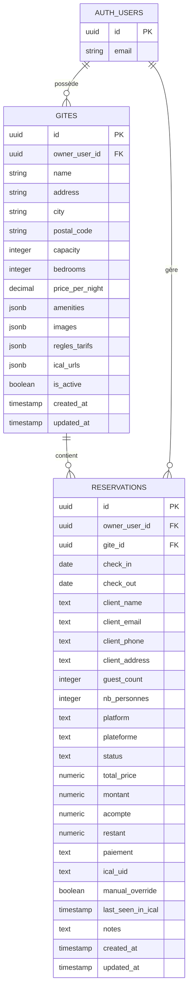
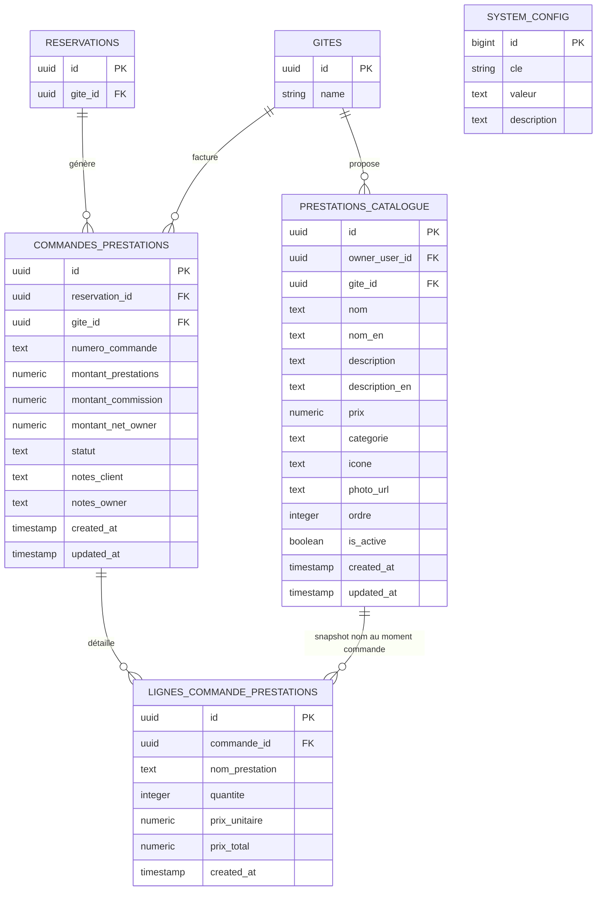
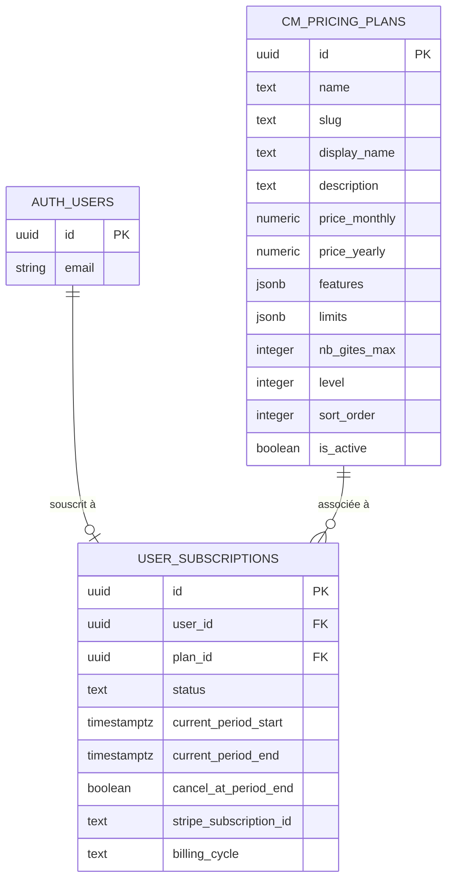
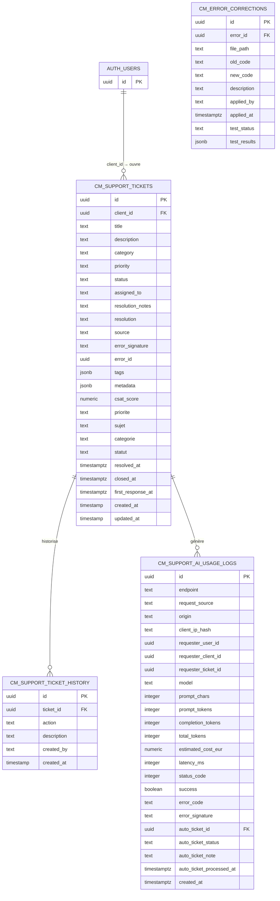
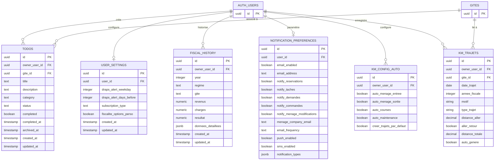
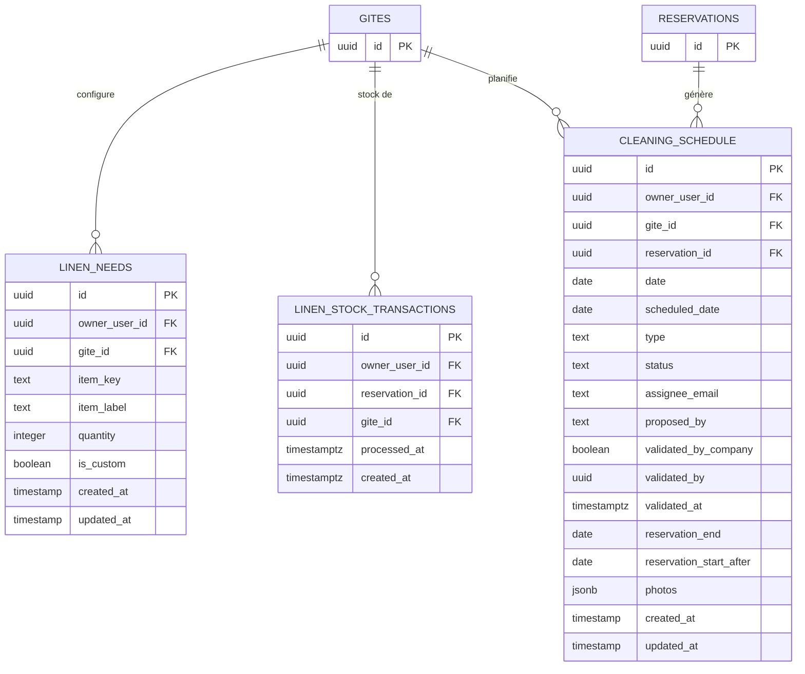

# Diagramme UML — Base de Données Gestion Gîte Calvignac

**Version :** 2.13.46 — Dernière MAJ : 28 mars 2026  
**Source de vérité :** `docs/ARCHITECTURE.md`

> ⚠️ Ce fichier doit être mis à jour **à chaque modification de schéma**.  
> Tout ajout/suppression de table ou colonne FK doit être reflété ici.

---

## Domaine Core — Gîtes & Réservations

---

## Domaine E-Commerce — Prestations

> Commission auto : `montant_commission = montant_prestations × taux` (taux dans `system_config.commission_prestations_percent`, défaut 5%)

---

## Domaine SaaS — Abonnements

---

## Domaine Support & Monitoring

---

## Domaine Owner — Outils & Préférences

---

## Domaine Ménage — Linge & Planning

---

## Vues (Views)

| Vue | Source | Description |
|-----|--------|-------------|
| `v_ca_prestations_mensuel` | `commandes_prestations` + `gites` | CA prestations agrégé par mois |
| `v_ca_prestations_annuel` | `commandes_prestations` + `gites` | CA prestations agrégé par année |
| `user_notification_preferences` | `notification_preferences` | Alias de compatibilité |
| `admin_communications` | `notifications` | Alias pour l'interface admin |
| `subscriptions_plans` | `cm_pricing_plans` | Alias de compatibilité |

---

## Règles Métier Critiques

| Règle | Table | Vérification |
|-------|-------|-------------|
| Un gîte = une seule réservation active à la fois | `reservations` | `check-overlapping-reservations.js` |
| Deux réservations ne démarrent pas le même jour sur un gîte | `reservations` | Contrainte applicative |
| Commission = 5% (configurable) | `commandes_prestations` | `system_config.commission_prestations_percent` |
| Token client dans URL ≠ auth Supabase | `reservations` | RLS via `app.reservation_token` |
